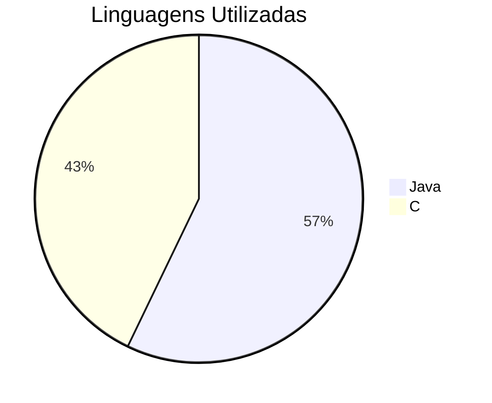

<table align="center" border="1" cellpadding="5" cellspacing="0" style="border-collapse: collapse; border: 1px solid black;">
  <tr>
    <td style="border: 1px solid black; padding: 5px;">
      <p style="text-align: center;">Bem vindos a Organização</p>
      <p style="text-align: center;"><a href="https://github.com/ifsc-sj-projetos/" target="_blank">&nbsp&nbsp&nbsp&nbsp&nbsp&nbsp&nbsp&nbsp&nbspIFSC-SJ-Projetos</a></p>
    </td>
  </tr>
</table>

---

#### IFSC - Campus São José - Projetos

<div align="center">

[](#)
[](#)
[](#)
[](#)


[Website](https://www.ifsc.edu.br/en/web/campus-sao-jose) | [GitHub Organization](https://github.com/ifsc-sj-projetos)

</div>

---

####  📚 Sobre a Organização

Esta organização reúne projetos desenvolvidos nas disciplinas ministradas pelo Prof. [Dr. Ramon Mayor Martins](rmayormartins.github.io) no [Instituto Federal de Santa Catarina - Campus São José](ifsc.edu.br). As disciplinas abrangem diferentes cursos e áreas de conhecimento na computação.

---

####  🛠️Disciplinas e Ambientes de Desenvolvimento


| Curso                                 | Disciplina                                        | Linguagem | Ambiente de Desenvolvimento                                                | Objetivo                                                     |
| ------------------------------------- | ------------------------------------------------- | --------- | -------------------------------------------------------------------------- | ------------------------------------------------------------ |
| Engenharia de Telecomunicações        | PRG129001 - Programação I                         | C         | [GitHub](https://github.com/rmayormartins/IFSC-Codespace-ENG-C-PRG1)       | Fundamentos de programação estruturada                       |
| Engenharia de Telecomunicações        | POO129003 - Programação Orientada a Objetos       | Java      | [GitHub](https://github.com/rmayormartins/IFSC-Codespace-ENG-ADS-JAVA-POO) | Conceitos de OOP aplicados à Engenharia                      |
| Análise e Desenvolvimento de Sistemas | POO786202 - Programação Orientada a Objetos       | Java      | [GitHub](https://github.com/rmayormartins/IFSC-Codespace-ENG-ADS-JAVA-POO) | Aprofundamento em paradigmas OOP                             |
| Análise e Desenvolvimento de Sistemas | ALG786201 - Algoritmos e Pensamento Computacional | Java      | [GitHub](https://github.com/rmayormartins/IFSC-Codespace-ENG-ADS-JAVA-POO) | Pensamento computacional, fundamentos de lógica e algoritmos |

---

#### 🗄️ Indice de Projetos de Jogos


| Data       | Curso  | Disciplina | Linguagem | Nome do Jogo       | Criador            | Público |
|------------|--------|------------|-----------|--------------------|--------------------|---------|
| 2024-2     | ENG    | POO        | Java      | Campo Minado       | iurid2003          | Privado |
| 2024-2     | ENG    | POO        | Java      | blobs              | lucas-ssf          | Público |
| 2024-2     | ENG    | POO        | Java      | Tetris             | jessicac13         | Privado |
| 2024-2     | ENG    | POO        | Java      | SpaceKraus         | GabrielKkraus      | Privado |
| 2024-2     | ENG    | PROG1      | C         | Jogo da Forca      | jessicaveig        | Privado |
| 2024-2     | ENG    | PROG1      | C         | Batalha Naval      | Jerrique           | Público |
| 2024-2     | ENG    | PROG1      | C         | Jogo da Velha      | arthuroliveira     | Público |
| 2024-2     | ENG    | PROG1      | C         | Jogo da Forca      | BryanPacheco97     | Público |
| 2024-2     | ENG    | PROG1      | C         | Jogo da Velha      | nicolas12091209    | Privado |
| 2024-2     | ENG    | PROG1      | C         | Quiz               | RuhanDiego         | Público |
| 2024-2     | ADS    | POO        | Java      | Last Days          | Ygor Gouveia da Costa | Público |
| 2024-2     | ADS    | POO        | Java      | Snake              | nicolasfvp         | Privado |
| 2024-2     | ADS    | POO        | Java      | CLI Blackjack      | jesse-rr           | Privado |
| 2024-2     | ADS    | POO        | Java      | Wordle             | sioterino-sx-nt-juliaturness | Público |

---

#### 🖥️ Distribuição de Linguagens


---

*Última atualização: Fevereiro de 2025*

#### 🧰 Mantenedor
```
Prof. Dr. Ramon Mayor Martins
Professor do IFSC - Campus São José
Áreas: Programação, Algoritmos e Estruturas de Dados
[Website Pessoal](https://rmayormartins.github.io/)
```
---

#### 📝 Licença

Este repositório e seus projetos estão sob licença específica. Consulte cada projeto individual para mais detalhes.

---

<div align="center">
  
#### IFSC - Campus São José - Projetos

</div>
